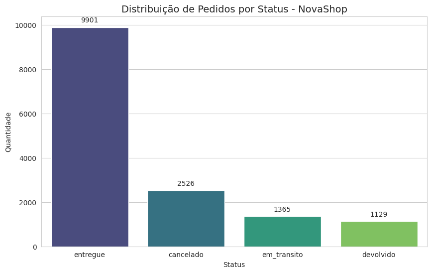
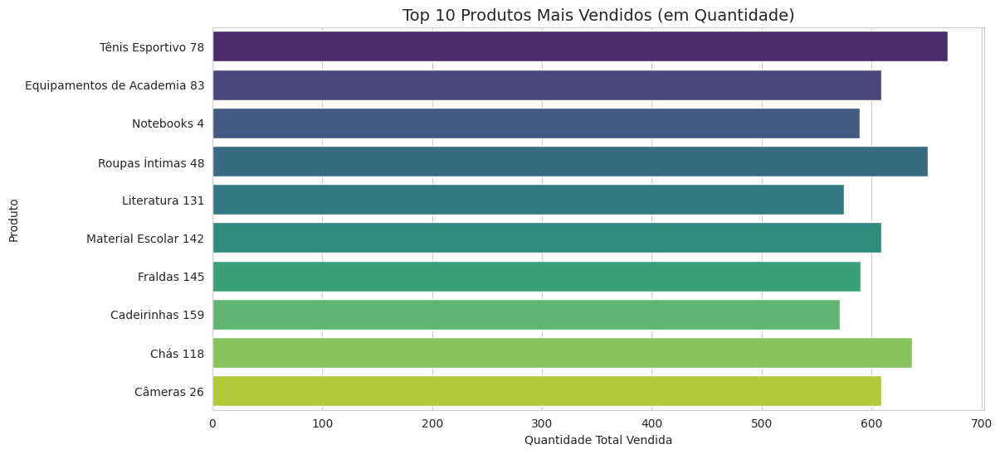
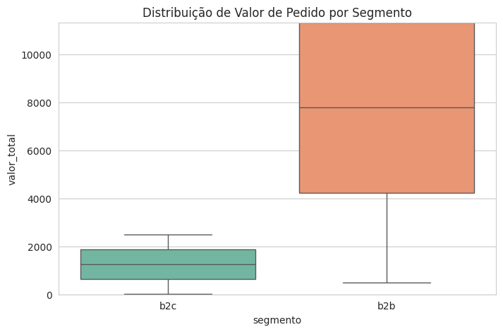
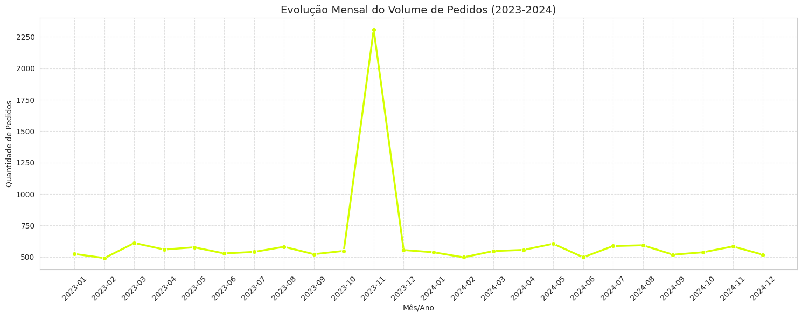
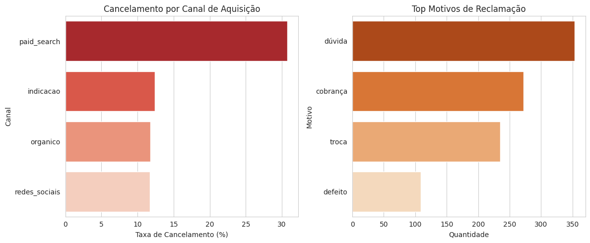

# Case de Consultoria Estratégica: NovaShop Analytics 

Este repositório contém a resolução do case técnico para a **Peers Group**, focado na análise de dados operacionais e de suporte da empresa **NovaShop**. O projeto utiliza Python para processamento de dados e geração de insights estratégicos para otimização de faturamento e retenção de clientes.

## Objetivo do Projeto
O objetivo principal é realizar uma análise diagnóstica dos dados da NovaShop entre 2023 e 2024, identificando gargalos operacionais, comportamentos de consumo por segmento e causas raízes para o alto índice de cancelamentos.

---

# Resumo das Questões Analisadas

## Nota: Isso é apenas um resumo. Uma análise técnica mais aprofundada, incluindo o pipeline de limpeza de dados e justificativas estatísticas, encontra-se detalhada dentro do notebook.
Para visualizar o código fonte, os tratamentos de dados passo a passo e as visualizações interativas, acesse o arquivo:
**[analise_novashop.ipynb](./analise_novashop.ipynb)**

**Desenvolvido por:** Eduardo Almeida Cavalcanti de Melo
---
 

### Questão 1: Distribuição de Pedidos por Status
A operação apresenta um volume significativo de pedidos não convertidos. 
- **Entregues:** 66,36%
- **Cancelados:** 16,93%
- **Devolvidos:** 7,57%
  *Insight observado: Quase 25% da operação sofre com atritos de pós-venda ou cancelamentos prematuros.*

  

### Questão 2: Top 10 Produtos por Receita
O ranking é liderado pelo **Tênis Esportivo 78**, gerando mais de R$ 2 milhões em receita. 

#### Tabela de Performance: Top 10 Produtos por Receita

| Produto | Quantidade Vendida | Receita Total |
| :--- | :---: | ---: |
| **Tênis Esportivo 78** | 669 | R$ 2.017.790,51 |
| **Equipamentos de Academia 83** | 609 | R$ 1.961.350,85 |
| **Notebooks 4** | 589 | R$ 1.913.053,36 |
| **Roupas Íntimas 48** | 651 | R$ 1.906.096,07 |
| **Literatura 131** | 575 | R$ 1.880.745,06 |
| **Material Escolar 142** | 609 | R$ 1.849.905,02 |
| **Fraldas 145** | 590 | R$ 1.804.002,83 |
| **Cadeirinhas 159** | 571 | R$ 1.794.833,09 |
| **Chás 118** | 637 | R$ 1.765.601,55 |
| **Câmeras 26** | 609 | R$ 1.738.445,85 |

### Questão 3: Ticket Médio B2B vs B2C
Utilizando testes estatísticos, foi confirmado que o segmento **B2B** possui um ticket médio aproximadamente **6 vezes superior** ao B2C (R$ 7.778 vs R$ 1.264). A diferença foi validada com um p-valor de 0.0000, indicando alta relevância estatística.

### Questão 4: Sazonalidade e Tendências
Foi identificado um pico massivo de vendas em **Novembro de 2023**, com volume 4x superior à média mensal. A hipótese principal é o sucesso de campanhas de **Black Friday**, embora o crescimento orgânico nos meses adjacentes apresente estabilidade.

### Questão 5: Causa Raiz de Cancelamentos
O canal de **Paid Search (Busca Paga)** é o detrator crítico da operação, com uma taxa de cancelamento de **30,74%**. O motivo de suporte predominante é **"Dúvida"**, sugerindo que o investimento em anúncios está atraindo leads desqualificados ou com informações insuficientes sobre o produto.

### Questão 6: Qualidade e Sanitização de Dados
Durante a auditoria, foram tratados:
- **Encoding:** Correção de caracteres especiais (ex: "orgânico").
- **Missing Values:** Identificação e tratamento de 79 pedidos sem valor total.
- **Tipagem:** Padronização de datas para análises temporais precisas.

---

## Tecnologias Utilizadas
- **Python 3.x**
- **Pandas**: Manipulação e limpeza de dados.
- **Seaborn / Matplotlib**: Visualização de dados e dashboards.
- **Scipy**: Testes de hipóteses estatísticas.
